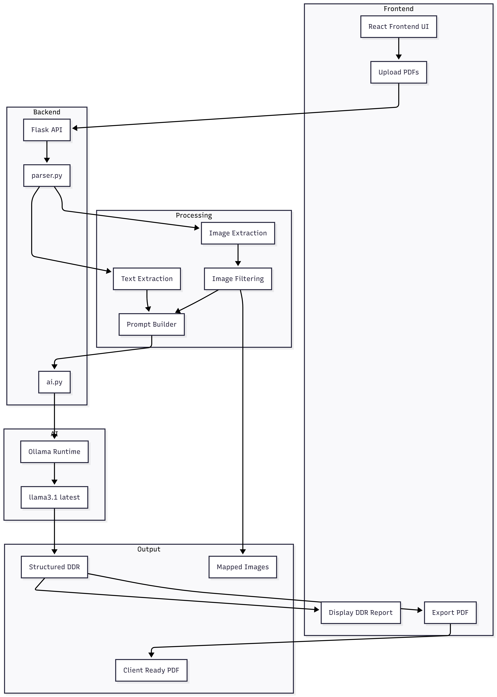
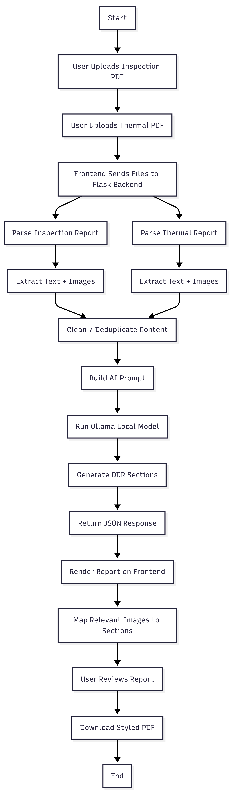

# AI DDR Generator
### AI-Powered Detailed Diagnostic Report Automation for Civil Inspection Workflows

> Built for an Applied AI Builder assessment focused on solving a real business workflow using practical AI systems engineering.

---

## Executive Summary

AI DDR Generator is an end-to-end AI application that converts raw **Inspection Reports** and **Thermal Reports** into a professional, structured **Detailed Diagnostic Report (DDR)**.

Instead of manually reviewing technical site reports and preparing client deliverables, the system automates the full workflow:

- Reads two independent source reports
- Extracts textual findings and embedded images
- Merges observations logically
- Handles missing or conflicting data
- Generates a client-ready DDR
- Exports a polished PDF report

This project demonstrates applied AI beyond prompting — combining document intelligence, local LLM orchestration, workflow automation, report generation, and engineering tradeoffs under real constraints.

---

## Why This Problem Matters

In civil diagnostics, waterproofing inspections, structural maintenance, and property audits, engineers work with fragmented inputs:

- Visual inspection notes
- Dampness and seepage findings
- Thermal camera reports
- Temperature observations
- Site photographs

Preparing final reports manually is time-consuming, repetitive, inconsistent between engineers, difficult to scale, and error-prone. This project automates that process into a repeatable workflow.

---

## Project Structure

```
ddr-ai-generator/
├── backend/
│   ├── app.py
│   ├── ai.py
│   └── parser.py
├── frontend/
│   └── src/
│       ├── App.jsx
│       └── index.css
├── uploads/
├── extracted_images/
├── requirements.txt
└── README.md
```

---

## Prerequisites

Ensure the following are installed before running:

- Python 3.10+
- Node.js 18+
- npm
- Git
- [Ollama](https://ollama.com) installed locally

Pull the required model:

```bash
ollama pull llama3.1:latest
```

**Recommended machine:** 8GB+ RAM, SSD storage, Windows / macOS / Linux

---

## How to Run Locally

The project runs across **3 separate terminals**.

### 1. Clone the repository

```bash
git clone https://github.com/benjaminvinod/ddr-ai-generator.git
cd ddr-ai-generator
```

### 2. Create a Python virtual environment

```bash
python -m venv .venv
```

Activate it:

```bash
# Windows
.venv\Scripts\activate

# macOS / Linux
source .venv/bin/activate
```

### 3. Install Python dependencies

```bash
pip install -r requirements.txt
```

### 4. Start Ollama — Terminal 1

```bash
ollama run llama3.1:latest
```

Keep this terminal running in the background.

### 5. Start the Flask backend — Terminal 2

```bash
cd backend
python app.py
```

Runs on `http://127.0.0.1:5000`

### 6. Start the React frontend — Terminal 3

```bash
cd frontend
npm install
npm run dev
```

Runs on `http://localhost:5173`

### 7. Open in browser

Visit `http://localhost:5173`, upload both PDFs, and generate the DDR.

---

## Troubleshooting

| Issue | Fix |
|---|---|
| Ollama not responding | Ensure the Ollama desktop app or service is running |
| Model missing | Run `ollama pull llama3.1:latest` |
| Port already in use | Close previous Flask / Vite sessions and restart terminals |
| Python package issues | Delete `.venv`, recreate it, and reinstall dependencies |

---

## Solution Overview

The system accepts two input documents and produces one structured output.

**Input 1 — Inspection Report PDF**
- Area-wise observations
- Cracks, dampness, seepage notes
- Visible defects
- Embedded photographs

**Input 2 — Thermal Report PDF**
- Temperature readings
- Thermal anomalies
- Infrared imagery
- Moisture and heat indicators

**Output — Detailed Diagnostic Report**

1. Property Issue Summary
2. Area-wise Observations
3. Probable Root Cause
4. Severity Assessment (with reasoning)
5. Recommended Actions
6. Additional Notes
7. Missing or Unclear Information

The report can be exported as a PDF with supporting images.

---

## AI Layer

**Model:** `llama3.1:latest` served locally via Ollama

**Why a local LLM?**

This project was built without paid cloud API access. Running locally enabled zero API cost, offline execution, privacy of uploaded reports, and faster development iteration — while demonstrating self-hosted AI workflow design.

**Constraint handling on consumer hardware:**

| Problem | Mitigation |
|---|---|
| Slow inference on large prompts | Safe character limits on input |
| Memory pressure | Text cleanup and duplicate removal |
| Inconsistent output | Controlled token generation + low temperature |

---

## System Architecture



| Layer | Responsibility |
|---|---|
| React Frontend | File uploads, report viewing, PDF export |
| Flask Backend | API management and processing orchestration |
| Parser Layer | Text and image extraction from PDFs |
| AI Layer | DDR generation via Ollama + Llama 3.1 |
| Output Layer | Structured report delivery with evidence images |

---

## Pipeline Flow



1. User uploads both PDFs via the frontend
2. Backend receives and validates uploaded files
3. Text is extracted page-wise from each report
4. Images are extracted and filtered for relevance
5. Data is cleaned and prepared for prompting
6. Prompt is constructed and sent to the LLM
7. AI returns structured DDR sections
8. Frontend renders the report and user exports a PDF

---

## Core Engineering Components

### 1. Document Parsing Engine

Extracts readable text from uploaded PDFs using page-wise extraction, whitespace cleanup, duplicate line removal, and safe context truncation for LLM stability.

### 2. Image Extraction Pipeline

Extracts relevant embedded images from both reports. Filters out tiny icons, decorative graphics, duplicate assets, and UI overlays. Only useful evidence images are retained.

### 3. AI Report Generation Engine

The structured prompt instructs the model to:

- Use only facts present in the source documents
- Avoid hallucinated claims
- Flag conflicting information between documents
- Explicitly mention missing data as "Not Available"
- Return all required DDR sections in consistent format

### 4. Reliability Controls

Conservative inference settings and controlled output length ensure stable behaviour on local hardware. Fallback language (`Not Available`, `Conflicting findings detected`, `Further inspection recommended`) is used when data is absent.

### 5. Report Delivery Layer

Users receive two output formats:
- **On-screen report** — structured DDR rendered in the browser
- **Downloadable PDF** — styled sections with findings and supporting images

---

## Image Placement Logic

Images are mapped to relevant report sections using a deterministic heuristic:

- Hall observations → hall images
- Bathroom findings → bathroom images
- Thermal evidence → thermal image blocks

If an expected image is unavailable, the section notes: *"Relevant image not available."*

---

## Validation & Testing

| Scenario | Status |
|---|---|
| Dual PDF upload | ✅ Tested |
| Missing file handling | ✅ Tested |
| AI generation success | ✅ Tested |
| Large input stability | ✅ Tested |
| Image extraction correctness | ✅ Tested |
| PDF export correctness | ✅ Tested |
| Backend connectivity handling | ✅ Tested |

---

## Design Decisions & Tradeoffs

**Why not OCR?**
The provided reports are machine-readable PDFs, so direct parsing is faster and more accurate. OCR would be added in production for scanned documents.

**Why not GPT or Claude APIs?**
Local LLM usage demonstrates stronger engineering ownership under zero-budget constraints.

**Why character limits on input?**
To keep inference stable and predictable on consumer-grade hardware.

**Why heuristic image mapping?**
Full semantic image-to-room matching requires additional AI vision infrastructure. For a 24-hour assignment, a deterministic mapping approach was the right tradeoff.

---

## Tech Stack

| Layer | Technology |
|---|---|
| Frontend | React (Vite), CSS3, jsPDF |
| Backend | Python, Flask, PyMuPDF (fitz) |
| AI | Ollama, Llama 3.1 (local) |

---

## Future Improvements

**AI**
- Better thermal anomaly reasoning
- Human review and correction mode
- Fine-tuned domain-specific model

**Document Intelligence**
- OCR support for scanned PDFs
- Table extraction
- Handwritten note parsing

**Product**
- Multi-property batch uploads
- Client-facing dashboard
- Cloud deployment
- Report version history

---

## Google Drive Link

https://drive.google.com/drive/folders/1ef5U20ZWAEkUSrlzS0rzcNqncO_fX3S6?usp=sharing
